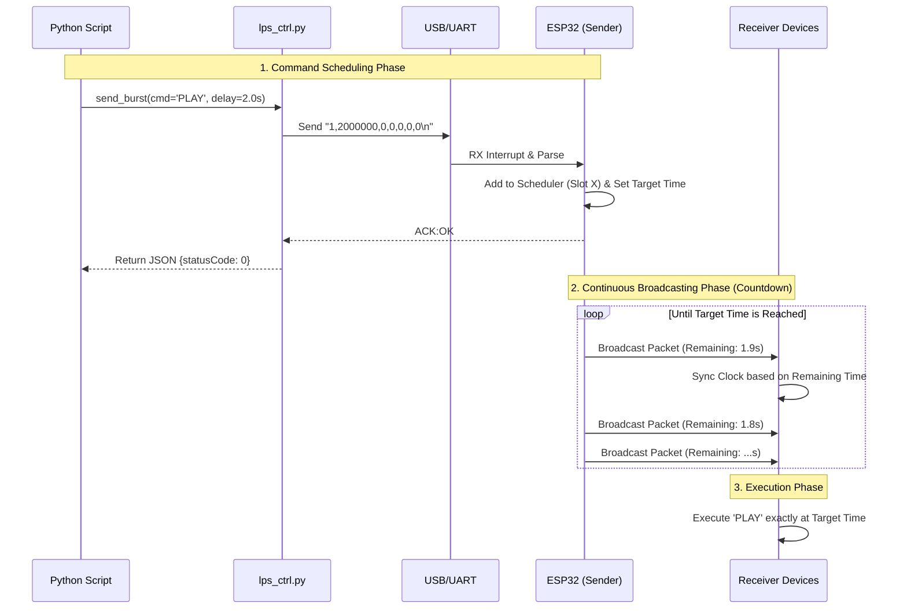
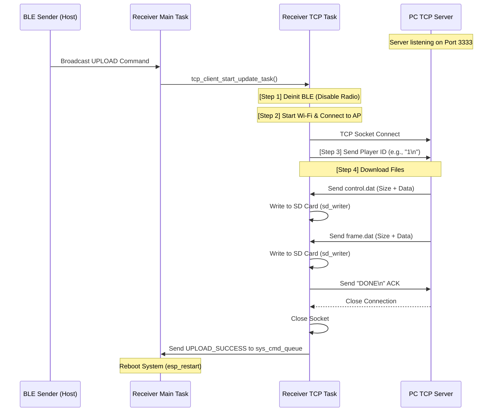

# ESP32 BLE Sender & TCP OTA Server

This project provides a Python module, `lps_ctrl.py`, which implements a unified control system for an ESP32 network. It features two core components:

1. **BLE Sender (`ESP32BTSender`)**: Controls an ESP32 via UART (USB Serial) from a PC, acting as a central Sender to broadcast Bluetooth Low Energy (BLE) command packets using a non-blocking scheduler for precise, synchronized actions across distributed receivers.
2. **TCP Server (`Esp32TcpServer`)**: An asynchronous TCP server designed to push Over-The-Air (OTA) updates (control and frame data files) to individual receiver nodes over a local Wi-Fi network.

## Installation & how to get USB port name if you are not Windows user

It is recommended to create a virtual environment in the `lps-ctrl` directory (where `pyproject.toml` is located) and install the required packages.

### 1. Windows

```bash
python3 -m venv venv
# or try: python -m venv venv
source venv/bin/activate
# or try: .\venv\Scripts\Activate.ps1
# or try: .\venv\Scripts\activate.bat
python.exe -m pip install --upgrade pip
pip install -e .
python .\examples\lps_ctrl_ex.py
```

If you still fail to install/activate venv:
```bash
pip install -e .
python .\examples\lps_ctrl_ex.py
```

### 2. MAC

Get USB port:
```bash
ls /dev/cu.*
```
And the process is the same as Windows.

### 3. WSL

In windows terminal:
```bash
winget install --interactive --exact dorssel.usbipd-win
usbipd list # the 'x-x' in the list: <busid>
sudo usbipd bind --busid <busid>
usbipd attach --wsl --busid <busid>
```
In wsl:
```bash
sudo apt install usbutils
lsusb
ls /dev/ttyUSB*
```
And you will get use port name. (Remember to fill in this name into lps_ctrl_ex.py)

```bash
python3 -m venv venv
source venv/bin/activate
pip install -e .
sudo chmod 666 /dev/ttyUSB0 # your usb name (ls /dev/ttyUSB*)
python3 examples/lps_ctrl_ex.py
```

#### ⚠️ Re-plugging Workflow for WSL
If you unplug and replug the ESP32, you **do not** need to run all commands again, but you **MUST** repeat the attach and permission steps:

1. In Windows Terminal: `usbipd attach --wsl --busid <busid>`
2. In WSL: `sudo chmod 666 /dev/ttyUSB0`
3. Then you can run the python script again.

## Part 1: BLE Broadcasting (`ESP32BTSender`)

### System Workflow



### Key Concepts

1. **PC-Side (`ESP32BTSender`)**: Formats parameters into a CSV string and sends it via Serial. It waits for an `ACK` from the ESP32 to confirm the command was accepted.
2. **ESP32 Scheduler (Immediate Broadcast)**:
* Once a task is added, the ESP32 **immediately starts broadcasting** it in a round-robin fashion.
* The broadcast packet contains the **remaining time** (counting down in real-time) until the target execution timestamp.
* Broadcasting stops automatically when the target timestamp is reached.


3. **Synchronization**: Receivers listen for these packets. Even if they receive the packet at different times (e.g., one at 1.9s remaining, another at 0.5s remaining), they both calculate the same absolute **Target Execution Time**, ensuring synchronized action.

### API Documentation (`ESP32BTSender`)

#### Class: `ESP32BTSender`

```python
__init__(port, baud_rate=115200, timeout=1)
```

* **port** (Required): Serial port name (e.g., `'COM3'` on Windows or `'/dev/ttyS3'` on Linux).
* **baud_rate**: Default is `115200`. Must match the `main.c` setting in the firmware.
* **timeout**: Default is `1` second.

#### Method: `send_burst`

Sends a command packet to the ESP32, and it will return .json.

```python
send_burst(cmd_input, delay_sec, prep_led_sec, target_ids, data)
```
```json
{
    "from": "Host_PC",
    "topic": "command",
    "statusCode": 0, //0:success -1:fail
    "payload": {
        "target_id": "[]",
        "command": "PLAY",
        "command_id": "0",
        "message": "Success"
    }
}
```


**Parameters**

| Parameter | Type | Description |
| --- | --- | --- |
| **cmd_input** | `str` | Command type (see Mapping Table below). |
| **delay_sec** | `float` | Time in seconds before the command executes. **Must be > 1.0s**. |
| **prep_led_sec** | `float` | Duration for the "Preparation LED" effect. **Must be > 1.0s**. |
| **target_ids** | `list[int]` | List of Target IDs (e.g., `[1, 2]`). Use `[]` for **Broadcast All**. Use `[0]` for **Broadcast to error or unmounting ESP32**. |
| **data** | `list[int]` | list of 3 integers `[d0, d1, d2]` for extra parameters. |

**Command Mapping Table**

| Command | Hex Code | Description | Data Parameter Usage |
| --- | --- | --- | --- |
| **PLAY** | `0x01` | Start timeline/playback. | None |
| **PAUSE** | `0x02` | Pause playback. | None |
| **STOP** | `0x03` | Stop and reset position. | None |
| **RELEASE** | `0x04` | Release memory/Unload. | None |
| **TEST** | `0x05` | Test Mode / LED Color. | `[R, G, B]` (0-255) or `[0,0,0]` for default pattern. |
| **CANCEL** | `0x06` | Cancel a pending command. | `[cmd_id]` (Use the ID returned by send_burst). |
| **UPLOAD** | `0x08` | Enter System Upload Mode (Trigger TCP client). | None |
| **RESET** | `0x09` | System Reboot. | None |
* `CHECK`: using `trigger_check`

#### Method: `trigger_check` & `get_latest_report`

Used for requesting and fetching device status.

```python
sender.trigger_check(target_ids=[]) # fill in player ids or [0](all)
time.sleep(2) # Wait for ESP32 to scan
report = sender.get_latest_report()
```
```json
{
    "from": "Host_PC",
    "topic": "check_report",
    "statusCode": 0,
    "payload": {
        "scan_duration_sec": 2,
        "found_count": 1,
        "found_devices": [
            {
                "target_id": 1,
                "cmd_id": 0,
                "cmd_type": "PLAY",
                "target_delay": 9365664,
                "state": "TEST"
                "timestamp": 1773239516.9176354
            }
        ]
    }
}
```


## Part 2: TCP OTA Server (`Esp32TcpServer`)

The `Esp32TcpServer` acts as an asynchronous file server. When the ESP32 receivers receive the `UPLOAD` command via BLE, they disable Bluetooth, connect to the local Wi-Fi, and open a TCP socket to this server to download their specific `control.dat` and `frame.dat` files.

### System Workflow



### API Documentation (`Esp32TcpServer`)

#### Class: `Esp32TcpServer`

```python
__init__(control_paths_list, frame_paths_list, host='0.0.0.0', port=3333)
```

* **control_paths_list**: A list of file paths to the `control.dat` files, indexed by Player ID (e.g., index 0 corresponds to Player 1).
* **frame_paths_list**: A list of file paths to the `frame.dat` files, indexed by Player ID.
* **host**: The interface to bind to (default `'0.0.0.0'` for all interfaces).
* **port**: The TCP port to listen on (default `3333`).

#### Method: `start`

Starts the asynchronous server event loop.

```python
await server.start()
```

## Example Usage

### 1. BLE Control Script (`lps_ctrl_ex.py`)

Run this script to send broadcast commands:

```python
from lps_ctrl import ESP32BTSender

def main():    
    try:
        with ESP32BTSender(port='COM3') as sender:
            # Trigger an upload sequence on all receivers
            response = sender.send_burst(cmd_input='UPLOAD', delay_sec=16.0, prep_led_sec=0, target_ids=[], data=[0,0,0])
            print(response)
    except Exception as e:
        print(f"Error: {e}")

if __name__ == "__main__":
    main()
```

### 2. TCP Server Script (`tcp_example.py`)

Run this script to start the file hosting server *before* triggering the `UPLOAD` command:

```python
import asyncio
import os
from lps_ctrl import Esp32TcpServer

async def main():
    NUM_PLAYERS = 32
    BASE_DIR = r"D:\light_dance\ESP32_Advertiser\lps-ctrl\src\lps_ctrl\test_data"
    # you should type your own dir
    
    all_control_paths = []
    all_frame_paths = []

    # Map paths based on Player ID
    for i in range(1, NUM_PLAYERS + 1):
        player_dir = os.path.join(BASE_DIR, f"Player_{i}")
        all_control_paths.append(os.path.join(player_dir, "control.dat"))
        all_frame_paths.append(os.path.join(player_dir, "frame.dat"))

    server = Esp32TcpServer(
        control_paths_list=all_control_paths,
        frame_paths_list=all_frame_paths,
        port=3333
    )

    await server.start()

if __name__ == '__main__':
    asyncio.run(main())
```